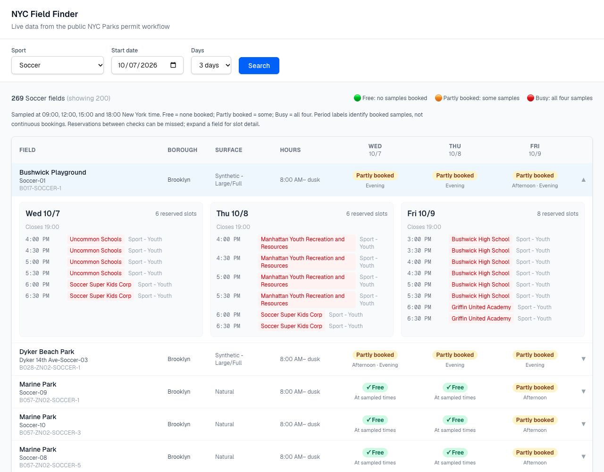

# NYC Field Finder

I built a comparison table for NYC Parks field availability, with boroughs, park names and expandable permit details.

Built as a time-boxed engineering case study (April 2026), later cleaned up and extended.

## The problem

> **Draft — awaiting my confirmation or rewrite from the original workflow:** League organizers and coaches need to find a field that fits their sport, location and schedule. The official NYC Parks permit map makes comparing several fields across several days awkward: I wanted to bring those choices into one table, then inspect the exact reservations before pursuing a permit.



## What I built

- I reverse-engineered the permit map's vector tiles into a catalog of about **5,200 fields**, then added boroughs and an exact `gispropnum` join to [NYC Open Data park names](https://data.cityofnewyork.us/Recreation/Parks-Properties/enfh-gkve).
- I found the **public JSON endpoints** behind the map and built a query flow that costs **four bulk calls per day**, regardless of field count. Slot detail is fetched only when a row is expanded.
- I added **disk caching with TTLs** (15 minutes for snapshots, 30 minutes for detail), serialized availability requests with delays, and shared the data-access code between the Next.js app and exploration CLI.

## Quick start

**Node 22.6+** is required for `--experimental-strip-types`.

```bash
npm install && npm run catalog && npm run dev
```

Open [localhost:3000](http://localhost:3000). Choose Soccer and three days, then expand a field.

Catalog setup fetches metadata only: 182 tiles in small batches and one park-name lookup. Cold-build time depends on NYC Parks latency; subsequent runs reuse the cache. To refresh metadata: `npm run catalog -- --refresh`.

The original exploration CLI now imports the same library: `npm run poc -- SCR 2026-10-08 3`. It prints a short summary and saves JSON under `data/cache/`; an optional field ID fetches that field's slot detail.

## Architecture

**Next.js App Router · TypeScript · React**

```text
app/page.tsx                  Search → comparison table → expanded slots
app/api/availability/         Validated query → four snapshots per date
app/api/field-detail/         Validated field/date → weekly permit detail
lib/field-catalog.ts          Vector-tile catalog + cached park-name join
lib/availability-client.ts    Snapshot summaries, slot normalization, caching
lib/validation.ts            Shared input validation
scripts/catalog.mjs          Catalog-only setup and refresh
```

All caches live in gitignored `data/cache/`. The field catalog and park-name lookup are reused until explicitly refreshed. Both JSON endpoints and the vector tiles accept the tool's honest `NYCFieldFinder/0.1` User-Agent; no browser process, credentials or spoofed browser identity is needed. [Data-access notes](docs/data-access-plan.md) cover endpoint schemas, caching and the verified park-name join.

Suggested GitHub description: **Compare NYC Parks field availability across dates, with park locations and expandable permit details.**

## Known limitations

- **Sampled availability:** checks run at **09:00, 12:00, 15:00 and 18:00 New York time**. Free means no samples booked; Partly booked means some; Busy means all four. Morning/afternoon/evening labels describe booked samples, not continuous reservations. Bookings between checks can be missed; expand a row and confirm availability with Parks before pursuing a permit.
- **Slot detail:** I show the number of returned in-season issued/pending reservation slots, not an estimated number of free slots. No returned reservations does not guarantee a field is open or bookable.
- **Scope:** searches cover up to seven days and display up to 200 fields, with mixed availability first. The public endpoints are undocumented, and cached data can become stale.
- **Locations:** the October 2026 refresh matched park names for 5,200 of 5,207 fields. Unmatched fields retain their field name and borough. This is a local case study, not a booking service.

## Tests

```bash
npm ci
npm run lint
npx tsc --noEmit
npm test
npm run build
```

The 15 dependency-free tests cover input validation, cache-path safety, date ranges, morning/afternoon/evening sampling, slot normalization, cache TTLs, concurrent request deduplication and location keys. CI runs lint, type-check, tests and a production build on pushes to `main` and pull requests. I also checked live searches, expanded permit details and desktop/mobile layouts in the browser; the screenshot above uses live October 2026 data.
